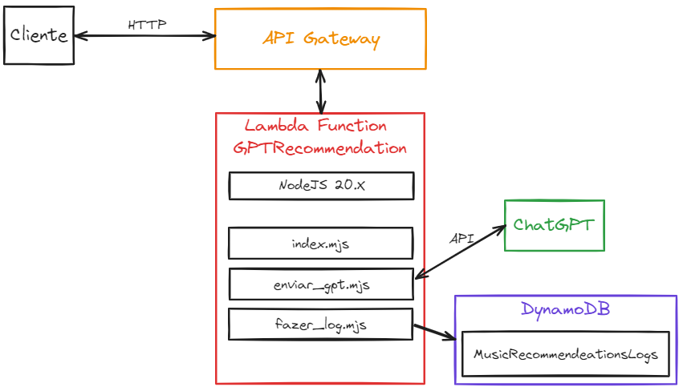
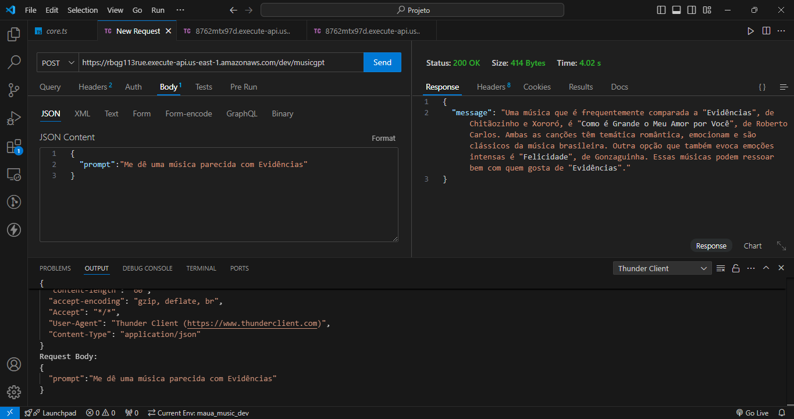

# GPTMusic 🎵
Projeto para a disciplina ECM967 - Tópicos Avançados em Back End

## Análise e recomendações de músicas utilizando Chat GPT

## 🧑🏻‍💻 Integrantes
#### Caio Rabinovich Panes Brunholi	RA: 20.01285-3
#### Felippe Onishi Yaegashi		RA: 20.00255-6
#### Carolina Perez 				RA: 20.00968-2

## 🚩 Objetivo
O objetivo do projeto é a partir de um pedido do usuário, o sistema pode recomendar novas músicas que tenham as características especificadas por ele

# 🚀 T1

### 🏠 Arquitetura do sistema


### 💻 Uso
Invoke URL:
```
https://rbqg113rue.execute-api.us-east-1.amazonaws.com/dev/musicgpt
```

Modelo de Uso:
```
{
  "prompt":"Me dê uma música parecida com Evidências"
}
```

#### Thunder Client


#### Video
[Video](media/GPTMusicT1.mov)
