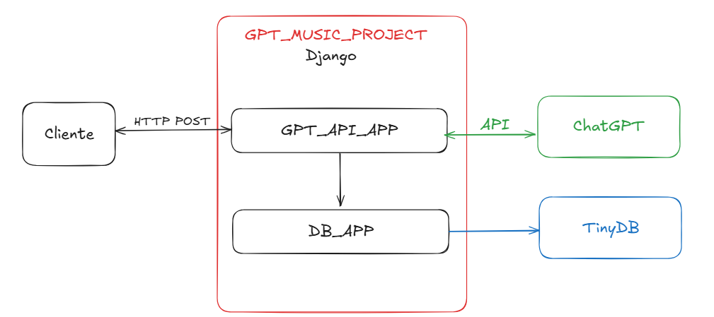
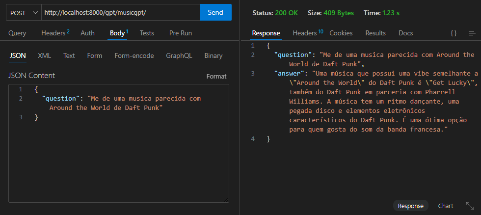

# GPTMusic 🎵
Projeto para a disciplina ECM967 - Tópicos Avançados em Back End

## Análise e recomendações de músicas utilizando Chat GPT

## 🧑🏻‍💻 Integrantes
#### Caio Rabinovich Panes Brunholi	RA: 20.01285-3
#### Felippe Onishi Yaegashi		RA: 20.00255-6
#### Carolina Perez 				RA: 20.00968-2

## 🚩 Objetivo
O objetivo do projeto é a partir de um pedido do usuário, o sistema pode recomendar novas músicas que tenham as características especificadas por ele

# 🚀 T1

### 🏠 Arquitetura do sistema


### 💻 Uso
Invoke URL:
```
https://rbqg113rue.execute-api.us-east-1.amazonaws.com/dev/musicgpt
```

Modelo de Uso:
```
{
  "prompt":"Me dê uma música parecida com Evidências"
}
```

#### Thunder Client


#### Video
[Video](media/GPTMusicT1.mov)
</br>
https://youtu.be/FpQIJcbByGM

</br>
</br>
</br>

# 🚀 T2

### 🏠 Arquitetura do sistema
O T2 utiliza o framework Python **Django** como Back-End

O **TinyDB** foi escolhido como banco de dados não relacional para este projeto devido à sua simplicidade e facilidade de integração. Ele é leve, roda localmente e não requer instalação e configuração de bancos de dados (como MongoDB), tornando-se ideal para armazenar pequenas quantidades de dados, como perguntas e respostas do ChatGPT



### ⚙ Instalação
Após clonar o repositório, crie um ambiente virtual Python (venv):
```bash
python -m venv <NOME>
```
Ative o ambiente:
```bash
[linux]
source <NOME>/bin/activate 

[Windows]
source <NOME>/Scripts/activate 
```
Instale as bibliotecas:
```bash
pip install -r requirements.txt
```
Então inicie o projeto:
```bash
python .\manage.py runserver
```

### 💻 Uso
Faça uma requisição `HTTP POST` na url:
```bash
http://localhost:8000/gpt/musicgpt/
```
Modelo de Uso:
```bash
{
  "question": "Me de uma musica parecida com Around the World de Daft Punk"
}
```
#### Thunder Client



#### Video
[Video](media/GPTMusicT2.mp4)
</br>
https://youtu.be/h0fxsTF-p6w

